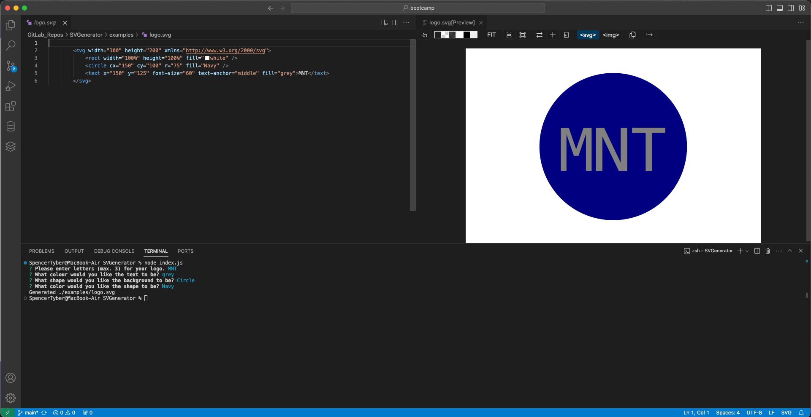

# SVGenerator

## Description

A simple CLI app that prompts users to select 3 characters of text, a text colour, a background shape, and a background shape colour to automatically generate a tidy .svg file to act as a logo. This project demonstrates usage of Jest unit tests and Node.js Inquirer for obtaining user input.

## Link to Deployed Website

https://spec-tr.github.io/SVGenerator/

## Installation/Usage Demo Video

[Click here to watch the demo video](https://drive.google.com/file/d/1dXKiP6rpecpanj-zkiq9fUI5oFSjGyKa/view)

## Technologies

### JavaScript
### HTML
### CSS

## Credits & Sources

Information and documentation used in the creation of this app, but external to the EdX UofT Full-Stack Software Development Bootcamp including syntaxes, best practises and instructional examples for usage came from the following sources:
- https://www.npmjs.com/package/inquirer?activeTab=readme
- https://jestjs.io/docs/getting-started
- https://www.w3schools.com/js/js_switch.asp
- 

## License

See LICENSE file in repository